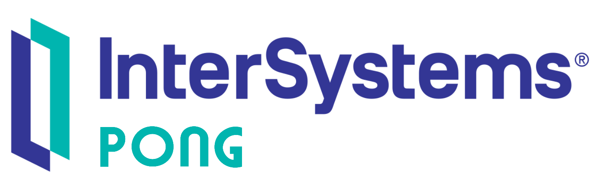

   
  
  <h1>InterSystemsPong</h1>
  

     Just a little Pong game with InterSystems IRIS.
  

<!-- Badges -->

   
   
   
   

---

Try it out [here](https://intersystems-dach.github.io/InterSystemsPong/).

---

by [Philipp B.](https://github.com/cophilot)
